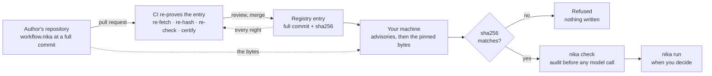

<p align="center">
  <a href="https://nika.sh">
    <picture>
      <source media="(prefers-color-scheme: dark)" srcset="https://nika.sh/brand/nika-logo-dark.svg">
      
    </picture>
  </a>
</p>

<h1 align="center">Nika Registry</h1>

<p align="center">
  <strong>Find a workflow someone shared, run it by name, and know it is exactly what was reviewed.</strong><br>
  Each entry pins the exact bytes in its author's repository. Your machine checks them before anything runs, and CI re-checks every entry every night.
</p>

<p align="center">
  <a href="https://github.com/supernovae-st/nika-registry/actions/workflows/verify.yml"></a>
  <a href="CATALOG.md"></a>
  <a href="https://github.com/supernovae-st/nika-spec/blob/main/registry/registry-v0.1.md"></a>
  <a href="https://github.com/supernovae-st/nika/releases/latest"></a>
  <a href="https://docs.nika.sh"></a>
  <br>
  <a href="https://scorecard.dev/viewer/?uri=github.com/supernovae-st/nika-registry"></a>
  <a href="https://archive.softwareheritage.org/browse/origin/?origin_url=https://github.com/supernovae-st/nika-registry"></a>
  <a href="LICENSE"></a>
</p>

<!-- engine clips: served from the engine repository's main branch (media/), so they follow its latest render, not a release tag -->
<p align="center">
  <a href="https://github.com/supernovae-st/nika/raw/refs/heads/main/media/videos/nika-hero.mp4">
    
  </a>
</p>
<p align="center"><sub>Audit first, then run: what a workflow from this registry goes through on your machine. Click to open the video.</sub></p>

## What is Nika?

Nika turns repeatable AI work into a small file you keep. Say what you
want done, like *"every Monday, pull the action items out of my meeting
notes"*, and Nika writes it as a readable `.nika` workflow. Before
anything runs, `nika check` shows what the workflow will do, which models
and tools it uses, what it is allowed to touch and what it can cost,
without calling a model. You run it when you decide, with the model you
choose, local or cloud, and every run leaves a tamper-evident record you
can verify. One Rust binary, local-first, open source (AGPL-3.0).

| 1 · Say it | 2 · Check it | 3 · Run it | 4 · Prove it |
|:---:|:---:|:---:|:---:|
| Describe the job; Nika writes a `.nika` file | `nika check` audits it before any model is called | `nika run` with the model you choose | `nika trace verify` checks the run's record |

> [!TIP]
> **This registry is a head start on step 1.** Instead of writing a workflow,
> take one someone already shared. Each entry points at a file in its author's
> repository, pinned to a full commit and a sha256 fingerprint, with a
> certificate of what the engine found it can do. Nothing is copied here, and
> steps 2 to 4 stay on your machine.

<p align="center">
  <a href="#quick-start">Quick start</a> ·
  <a href="#what-you-get">What you get</a> ·
  <a href="#find-a-workflow">Find a workflow</a> ·
  <a href="#how-it-works">How it works</a> ·
  <a href="#publish-your-workflow">Publish</a> ·
  <a href="#why-you-can-trust-it">Trust</a> ·
  <a href="#reference">Reference</a>
</p>

## Quick start

Three steps, about two minutes, no API key.

**1 · Install the engine** (macOS or Linux · [other ways to install](https://docs.nika.sh/getting-started/installation)).

```sh
brew install supernovae-st/tap/nika
```

**2 · Get a shared workflow by name.** The helper script finds the entry,
checks the advisories, fetches the pinned bytes from the author's repository,
compares their sha256 with the entry, then audits the file with your `nika`.
It never runs the workflow. It needs Python 3.11 or newer.

```sh
git clone https://github.com/supernovae-st/nika-registry
python3 nika-registry/scripts/get.py meeting-actions
```

```text
→ supernovae-st/meeting-actions@0.2.0
  source  supernovae-st/nika-spec @ e255dbf72336 · examples/meeting-actions.nika
  sha256  a2bde7b7c6a60f34… ✓ (matches the pinned digest)
  wrote   meeting-actions.nika (3750 bytes)
  cert    clean=True · exec=no · llm_calls=1 · cost unbounded (set max_tokens)
  audit   nika check · clean
```

**3 · Run it.** This workflow turns a meeting transcript into typed action
items. Its `permits:` (what a workflow may read, write, reach and run) name
exactly one input file, so put your transcript there. `--model mock/echo`
rehearses the run with no key and no network (the mock echoes the prompt, so
the items are placeholders); without it, the workflow uses its own local
model, `ollama/qwen3.5:4b`.

```sh
mkdir -p examples/fixtures && cp my-meeting.txt examples/fixtures/meeting-transcript.txt
nika run meeting-actions.nika --model mock/echo
```

The items land in `out/action-items.json`, and the run leaves a trace under
`.nika/traces/` that `nika trace verify` checks.

<!-- motion: a registry coordinate fetched, re-hashed, re-checked and run -->

> [!IMPORTANT]
> **By coordinate, straight from the engine: blocked for now.** `nika check`
> and `nika run` accept a coordinate such as
> `registry:supernovae-st/meeting-actions@0.2.0` and do the fetch, the hash
> check and the audit themselves. This registry's `index.json` now uses schema
> 2, and engine releases up to v0.121.0 read schema 1 only, so a first fetch
> stops with `NIKA-REG-005` and writes nothing. Until an engine release reads
> schema 2, use the helper as above. A coordinate your engine had already
> cached still works, offline.

## What you get

<table>
  <tr>
    <td width="33%" valign="top"><b>Ready-made jobs</b><br>Meeting notes to action items, invoice reminders, release notes, support triage and more: each one a <code>.nika</code> file you can read before you run it.</td>
    <td width="33%" valign="top"><b>Exactly what was reviewed</b><br>An entry pins a full commit and a sha256. If a single byte differs from what was reviewed, you get a refusal, not a file.</td>
    <td width="33%" valign="top"><b>Checked before it runs</b><br>What you download goes through the same <code>nika check</code> as your own files: what it can touch and what it can cost, before any model is called.</td>
  </tr>
  <tr>
    <td valign="top"><b>Know what it can do</b><br>The <a href="CATALOG.md">catalog</a> shows, for every version, whether it can run programs, which tools it uses, how many model calls it makes and its cost ceiling.</td>
    <td valign="top"><b>Never rewritten</b><br>A published version never changes. A bad one is withdrawn by a public <a href="advisories/">advisory</a>, and that version can never be published again.</td>
    <td valign="top"><b>Re-proven every night</b><br>CI re-fetches, re-hashes and re-checks every entry on every pull request and every night: a source that vanishes or changes is caught by the next nightly run.</td>
  </tr>
</table>

<table>
  <tr>
    <td width="33%" align="center" valign="top">
      <a href="https://github.com/supernovae-st/nika/raw/refs/heads/main/media/videos/workflow-gallery.mp4"></a><br>
      <b>Start from a job</b><br><sub>The same showcase jobs are built into the engine: <code>nika try</code> lists them.</sub>
    </td>
    <td width="33%" align="center" valign="top">
      <a href="https://github.com/supernovae-st/nika/raw/refs/heads/main/media/videos/permits-audit.mp4"></a><br>
      <b>See what it may touch</b><br><sub>A workflow's <code>permits:</code> drawn as a map, and the escape the check catches.</sub>
    </td>
    <td width="33%" align="center" valign="top">
      <a href="https://github.com/supernovae-st/nika/raw/refs/heads/main/media/videos/static-check-fix.mp4"></a><br>
      <b>Caught before it runs</b><br><sub><code>nika check</code> finds two defects, then passes the fixed file.</sub>
    </td>
  </tr>
</table>

<p align="center"><sub>Click a poster to open its video.</sub></p>

## Find a workflow

Open [**CATALOG.md**](CATALOG.md): one row per version, with what it does and
what the engine's analysis found it can do (run programs or not, which tools,
how many model calls, what cost ceiling), each row linked to its certificate
in [`certs/`](certs/). The helper prints the whole list too:
`python3 nika-registry/scripts/get.py --list`.

A few to start with, all published by `supernovae-st` at version `0.2.0`:

| Workflow | What it does |
|---|---|
| `meeting-actions` | Transcript → typed action items {owner, task, due} |
| `invoice-chaser` | Ledger CSV → overdue filter → drafted reminders → human gate → drafts file |
| `csv-chart-report` | CSV → aggregate → rendered bar chart + markdown report · offline · deterministic |
| `competitor-radar` | sitemap → what changed this window → parallel page reads → one brief |
| `support-triage` | Ticket queue → typed triage → urgent escalation → triage board |
| `release-notes` | git log → typed release notes → CHANGELOG insert → team ping |

> [!WARNING]
> **"Clean" is not "safe".** A certificate proves that a workflow stays inside
> the `permits:` it declares. It cannot judge what a permitted program or tool
> does once it runs. A workflow allowed to run any program (`exec: true`) or
> any tool (`"*"`) is marked ⚠ wherever it is listed: read it before you run
> it.

> [!NOTE]
> Most workflows also have a `0.1.0` version. Those are frozen history,
> written for an older version of the language: today's engines refuse them,
> and their certificates say so (`parse_refused`, capabilities unknown). They
> stay listed because a published version is never rewritten or deleted. Ask
> for a name without a version and you get the newest one.

### Four ways to use an entry

| Way | What you type | Today |
|---|---|---|
| The helper script | `python3 scripts/get.py <name>` | Works: fetch, hash check and audit; it never runs the workflow |
| The engine, by coordinate | `nika run registry:<owner>/<name>@<version>` | Blocked on a first fetch (see the note above) |
| Inside your own workflow | `invoke: { workflow: "registry:<owner>/<name>@<version>" }` | `nika check` binds it; `nika run` refuses it for now |
| Agents and tools | one fetch of [`index.json`](index.json) | Works |

<details>
<summary><b>The helper script, in detail</b></summary>

- `get.py --list` prints every entry. `get.py <name>` takes the newest
  version; `get.py <owner>/<name>@<version>` takes an exact one. A bare name
  that two owners publish is refused: qualify it.
- It reads the advisories before any bytes move, and it refuses on an
  advisory, on a sha256 mismatch, or when a file of the same name already
  exists where you run it.
- It writes the file and stops. The `cert` line is what the registry's
  certifier found with its pinned engine; the `audit` line is what your engine
  says today. When they disagree, trust your audit.
- `NIKA_BIN` picks the engine used for the audit (default: the `nika` on your
  PATH). `OFFLINE_ROOT` reads sources from local checkouts
  (`<OFFLINE_ROOT>/<repository-name>`), for mirrors and machines without a
  network.

</details>

<details>
<summary><b>The engine, by coordinate, in detail</b></summary>

- `nika check` and `nika run` take `registry:<owner>/<name>`, with an
  optional `@<version>`. The owner is required.
- Without a version, the newest one resolves on the first call and your
  machine records it (a `pin` file), so the same short coordinate keeps
  meaning the same version afterwards.
- Before writing anything, the engine refuses a name that is not in the index
  (`NIKA-REG-001`, the guard against names an assistant makes up), a version
  an advisory withdraws (`NIKA-REG-002`), bytes that do not match the pinned
  sha256 (`NIKA-REG-003`), and an index that disagrees with its entry or has a
  shape it cannot vet (`NIKA-REG-005`). The sha256 of record comes from the
  entry file, never from the index alone.
- The verified file lands in `~/.nika/registry/<owner>/<name>/<version>.nika`,
  next to `<version>.meta.json` (its sha256, source pin and trust tier). Every
  later use re-hashes it first and works offline; a copy that changed refuses
  with `NIKA-REG-004` (delete it and run again).
- A workflow's `permits:` govern what it does when it runs, not the fetch.
- Entries carry no signature yet, so the engine reports them at the
  `unprovenanced` tier: "unsigned entry (v0.1 digest floor)". An operator can
  require a higher tier in `~/.nika/registry/policy.toml`; below it, the
  engine refuses with `NIKA-REG-008`.

</details>

<details>
<summary><b>Inside your own workflow (composition)</b></summary>

A task can invoke a registry entry as a child workflow. Declare in the parent
the boundary the child needs: its certificate's `permits_boundary` (in
`certs/<owner>/<name>/<version>.json`) is the starting point, plus any path it
lists for review, here the transcript the child reads.

```yaml
nika: compose-meeting-actions
permits:
  fs:
    read: ["examples/fixtures/meeting-transcript.txt"]
    write: ["out/action-items.json"]
  tools: ["nika:log", "nika:read", "nika:write"]
tasks:
  actions:
    invoke:
      workflow: "registry:supernovae-st/meeting-actions@0.2.0"
outputs:
  actions: ${{ tasks.actions.output }}
```

- `nika check` binds the coordinate without opening the child. It must carry
  an `@version` (`NIKA-COMP-001` otherwise) and must not loop back. Because
  the child stays closed, the check reports the boundary you declared for it
  as unused (`NIKA-DRIFT-001` hints), and a `--model` given to the parent does
  not reach the child, which keeps its own model.
- `nika run` refuses such a parent for now, before anything executes:
  `registry dependency … has no atomic owned-byte view`. To compose today,
  take the file with the helper and invoke it by path
  (`workflow: "meeting-actions.nika"`).

</details>

<details>
<summary><b>For agents, tools and badges</b></summary>

- [`index.json`](index.json) carries every entry in one fetch: source pin,
  sha256, certificate summary and advisory state.
- [`llms.txt`](llms.txt) teaches the same fetch-and-verify path to AI agents.
- Never install a name an assistant suggested without resolving it here
  first, and never skip the hash check.
- Every workflow has a live certificate badge, served from
  `badges/<owner>--<name>.json`. For example
  
  comes from:

  ```markdown
  
  ```

</details>

## How it works

The workflow itself never moves: it stays in its author's repository, and
every check, in CI and on your machine, reads the same pinned bytes.



- **Publish.** A pull request adds one small entry file. CI re-proves it, a
  maintainer reads it, and once merged it never changes.
- **Re-prove.** On every pull request and every night, CI fetches every pinned
  file again, re-hashes it, re-runs the language spec's conformance checker on
  it and re-derives its certificate with a pinned engine.
- **Use.** Your machine reads the advisories, fetches the pinned bytes from the
  author's repository, refuses on any sha256 mismatch, audits the file, and
  runs it only when you decide.

## Publish your workflow

Your workflow stays in your repository. The registry stores a pointer, a
sha256 and a certificate, never a copy, and your namespace is your GitHub
owner name: CI refuses an entry whose publisher does not own the source
repository.

**1 · Make it pass `nika check`** on the released engine. Declare its
`permits:`, and take endpoints and keys as `inputs:` instead of writing them in
the file. Today's language has nine top-level keys: `nika`, `model`, `inputs`,
`const`, `secrets`, `permits`, `run`, `tasks`, `outputs`.

**2 · Add one entry file** at
`registry/workflows/<your-github-owner>/<name>/<version>.toml`, copied from
[`ENTRY_TEMPLATE.toml`](ENTRY_TEMPLATE.toml): `source.rev` is a full
40-character commit (never a tag or a branch), `integrity.sha256` is
`shasum -a 256` of the exact file, and `license` is one of those allowed in
[`scripts/verify.py`](scripts/verify.py).

**3 · Open a pull request.** CI re-proves it, then a maintainer reads it,
prompts included, before merging. Green CI is necessary, not sufficient:
stored prompt injection is a real attack, and no automated check catches
intent.

> [!NOTE]
> The `supernovae-st/*` entries are generated from the example pack of the
> [language spec](https://github.com/supernovae-st/nika-spec) by
> `scripts/project_pack.py`, so they cannot drift from it: to add a
> first-party workflow, add a showcase to the spec. Entries under your own
> owner name are yours to write. Full rules: [CONTRIBUTING.md](CONTRIBUTING.md).

## Why you can trust it

Each rule closes a known way that shared code goes wrong. The registry's
eight numbered laws, each with the incident behind it and the gate that holds
it, are in [POLICIES.md](POLICIES.md).

| Rule | What it protects you from |
|---|---|
| A published version never changes; a bad one is withdrawn by an [advisory](advisories/), never deleted | packages vanishing or being swapped under you (left-pad, rug-pulls) |
| Sources are pinned to a full commit and a full sha256, never a tag or a branch | a tag silently moved to other code (the tj-actions rewrite) |
| CI re-hashes the fetched bytes | an entry that lies about its file (manifest confusion) |
| CI re-runs the spec's conformance checker | broken or lying workflows |
| Key-shaped strings fail the gate | credentials leaking through shared templates (the n8n class) |
| Your namespace is your GitHub owner name, and you must own the source repository | look-alike names and dependency confusion |
| Nothing executes at install time: entries and workflows are data | install-script worms (event-stream, Shai-Hulud, ComfyUI) |
| A withdrawn `name@version` is never reused, by anyone | impersonation through a freed name |

**Withdrawing a version.** A broken or compromised version is never deleted:
it gets an advisory in [`advisories/`](advisories/) (a small TOML file in the
spirit of OSV), which the helper and the engine read before any bytes move and
CI validates on every run. A tombstone advisory records a `name@version` that
is gone from the tree; nobody can publish it again. To report a bad version,
open an issue with the **Advisory** template.

The format is an open contract,
[registry-v0.1](https://github.com/supernovae-st/nika-spec/blob/main/registry/registry-v0.1.md),
part of the Apache-2.0 language spec, so a mirror, a fork or an in-house
registry can follow the same rules.

## Reference

<details>
<summary><b>What CI checks, step by step</b></summary>

[`verify.yml`](.github/workflows/verify.yml) runs on every push to `main`,
every pull request and every night. Pull request and push runs read sources
from a checkout of the spec at `SPEC_PIN`: deterministic, and stricter on a
commit that was force-pushed away. The nightly run fetches from GitHub like a
consumer does, so a vanished commit or a rewritten history turns it red.

| Step | What it holds |
|---|---|
| Immutability gate (pull requests) | no merged `registry/**/*.toml` is modified or deleted; the only exception is an operator's `advisories/OVERRIDE-<pr>.md`, itself the audit trail |
| Pin the checker at `SPEC_PIN` | the judge is the spec commit named in `SPEC_PIN`, never a moving branch |
| First-party entries match the spec pack | `scripts/project_pack.py --check` |
| Gate guards hold | `scripts/selftest.py`, plus the unit tests for certificate history, the engine pin and the heal branch |
| Retired-suffix ratchet | `scripts/suffix_ratchet.py`: no retired workflow-file suffix outside its pinned exceptions |
| Re-prove every entry | `scripts/verify.py --all`: R1 immutability · R2 full-commit and full-sha256 pins · R3 the fetched bytes match the sha256 · R4 the conformance checker passes the file · R5 no key-shaped string · R6 namespace = source owner · R7 license allowlist |
| Fetch the pinned engines | the current and the historical release, each sha256-checked before use |
| Certificates and catalog in sync | `scripts/cert.py --check` re-derives every certificate and byte-compares it |
| Index, `llms.txt` and badges in sync | `scripts/index.py --check` |
| Orphan gate | `scripts/orphan_gate.py`: every certificate, badge and index row belongs to a live entry |
| Estate manifest (observation, non-blocking) | `scripts/estate.py --check`: every tracked file declares where it comes from |
| Advisories parse | every advisory has its fields and names a live entry, or is a tombstone |
| `mirror` job | `scripts/estate.py` is byte-identical to nika-estate at `ESTATE_PIN` |

</details>

<details>
<summary><b>Replay the checks on your machine</b></summary>

You need a clone of [nika-spec](https://github.com/supernovae-st/nika-spec)
that contains the commit in `SPEC_PIN`.

```sh
pip install pyyaml jsonschema               # the conformance checker's dependencies
export NIKA_SPEC_DIR=/path/to/nika-spec     # the checker, at SPEC_PIN
export OFFLINE_ROOT=/path/to                # <OFFLINE_ROOT>/nika-spec resolves sources offline
python3 scripts/project_pack.py --check
python3 scripts/selftest.py
python3 scripts/suffix_ratchet.py
python3 scripts/verify.py --all
python3 scripts/index.py --check
python3 scripts/orphan_gate.py
python3 scripts/estate.py --check
```

The certifier is the one step that needs exact engines: the release named by
`ENGINE_VERSION` in `scripts/cert.py`, and the historical one that still
judges the frozen `0.1.0` entries. Any other binary is refused before a
single certificate is read.

```sh
NIKA_BIN=/path/to/nika NIKA_HISTORICAL_BIN=/path/to/nika-historical python3 scripts/cert.py --check
```

Maintainers bumping `SPEC_PIN` follow the three-stage procedure in
[AGENTS.md](AGENTS.md).

</details>

<details>
<summary><b>The catalog and the certificates</b></summary>

[`CATALOG.md`](CATALOG.md) is generated by `scripts/cert.py --write` from the
engine's static analysis of every pinned file: can it run programs, which
tools, how many model calls, what cost ceiling, which secrets could leak or
leave, and which `permits:` boundary it needs. Each row links a
machine-readable certificate under [`certs/`](certs/). You never have to take
its word: `nika check` re-derives the same analysis on your machine, and the
certificate's `permits_boundary` is what a parent workflow declares to compose
it.

Every certificate states how the analysis ended: `checked`, `parse_refused`
or `unavailable`. When the engine refuses to parse a file, the certificate
keeps the diagnostic and records every capability as `null`, which means
unknown, never "no" or "none". A reproduced refusal is not a runnable
workflow: it is repaired under a new version. The catalog and the badges
count clean results and unavailable analyses separately, and the helper never
suggests running a refused file.

</details>

<details>
<summary><b>How the registry keeps up with engine releases</b></summary>

[`release-heal.yml`](.github/workflows/release-heal.yml) runs every day. When
the engine has a new release, it moves the certifier's engine pin and the
sha256-checked download in `verify.yml`, re-derives the certificates, the
catalog, `index.json`, `llms.txt`, the badges and the estate manifest, and
opens one pull request for that release. Nothing lands directly: the verify
gate re-proves the heal like any other pull request.

</details>

<!-- city:map -->
## 🦋 The Nika family

| | Repository | What it gives you |
|---|---|---|
| 🦋 | [nika](https://github.com/supernovae-st/nika) | The engine and CLI: write, check, run and verify AI workflows |
| 📖 | [nika-docs](https://github.com/supernovae-st/nika-docs) | The documentation, live at [docs.nika.sh](https://docs.nika.sh) |
| 📜 | [nika-spec](https://github.com/supernovae-st/nika-spec) | The language specification and the suite that proves an engine follows it |
| 🧩 | [nika-vscode](https://github.com/supernovae-st/nika-vscode) | The editor extension: your workflow as a live graph, errors as you type |
| 🟦 | [nika-client](https://github.com/supernovae-st/nika-client) | Run and verify workflows from TypeScript |
| ✅ | [nika-action](https://github.com/supernovae-st/nika-action) | A GitHub Action that posts a `nika check` verdict on your pull requests |
| 🚀 | [nika-actions-starter](https://github.com/supernovae-st/nika-actions-starter) | A ready template: workflows, editor setup and CI from the first push |
| 📦 | **[nika-registry](https://github.com/supernovae-st/nika-registry)** | **Shareable workflows, pinned and re-verified** |
| 🤖 | [nika-plugins](https://github.com/supernovae-st/nika-plugins) | Teaches your coding agent (Claude Code, Codex, Cursor…) to write Nika |
| 🍺 | [homebrew-tap](https://github.com/supernovae-st/homebrew-tap) | `brew install supernovae-st/tap/nika` |
| 🐙 | [gh-nika](https://github.com/supernovae-st/gh-nika) | The Nika CLI as a GitHub CLI extension |
| 🏛️ | [nika-estate](https://github.com/supernovae-st/nika-estate) | Where each file in Nika's core repositories comes from, declared and re-checkable |
<!-- /city:map -->

## License, security and contributing

- **License.** The registry's metadata is [Apache-2.0](LICENSE). Each script
  names its license in its SPDX header, and each workflow carries its own
  `license` field.
- **Security.** Report a vulnerability privately to
  **security@supernovae.studio**, never in a public issue; the
  [organization's security policy](https://github.com/supernovae-st/.github/blob/main/SECURITY.md)
  covers this repository. A bad entry version is withdrawn through an
  [advisory](advisories/README.md).
- **Contributing.** Read [CONTRIBUTING.md](CONTRIBUTING.md) and
  [POLICIES.md](POLICIES.md). Every entry change is reviewed by a maintainer
  ([CODEOWNERS](.github/CODEOWNERS)).
- **Learn more.** The language, the engine and every way to install it are at
  [docs.nika.sh](https://docs.nika.sh); sharing has its own
  [guide](https://docs.nika.sh/guides/sharing).
